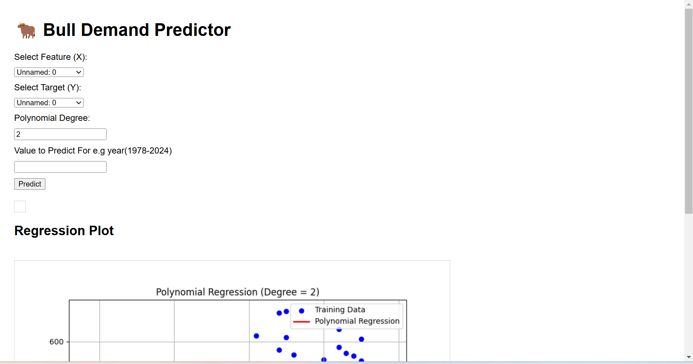

# Project Title

Bulls Demand Predictor - polynomial regression model which calculates how much bulls are needed based on historical data which can be directly related to population, this project includes a web interface and API for making predictions and visualising them

## Description

this predictor uses polynomial regression to calculate the number of bulls required in relation to the year or other features. it allows users of it to:

- select features and targets from a wrangled dataset
- perform polynomial regression with customizable degrees
- predict values with a given input
- vizualise the regression curve and actual data points

## Getting Started

### Dependencies

ensure these following dependencies

- numpy
- matplotlib
- pandas
- scikit-learn
- keras
- tensorflow
- pydot
- graphviz
- pydot-ng
- pillow
- pydotplus

you can install these libraries using

```
pip install -r requirements.txt
```

### Installing

Installing
Clone the repository:
git clone <repository-url>
cd <repository-folder>
Ensure the training_data.csv and testing_data.csv files are in the root directory.
python polynomial_regression_api.py
Run the Flask application:

### Executing program

- 1.start the flask server:

```
python polynomial_regression_api.py
```

- 2.open your browser and type in the url

http://127.0.0.1:5000


- 3.Use the web interface to:

- - select a feature e.g(YEAR) and a target- Select features and targets from a wrangled dataset.
- Perform polynomial regression with customizable degrees.
- Predict values with a given input.
- Visualize the regression curve and actual data points.

## Help

If you encounter any issues, ensure the following:

- The `training_data.csv` and `testing_data.csv` files are correctly formatted and present in the root directory.
- All required dependencies are installed.

For debugging, you can run the Flask application in debug mode:

```
command to run if program contains helper info
```

## Authors

- Dashiell Johnson
  Contributors names and contact info

ex. Mr Jones
ex. [@benpaddlejones](https://github.com/benpaddlejones)

## Version History

- 0.2
  - Various bug fixes and optimizations
  - See [commit change]() or See [release history]() or see [branch]()
- 0.1
  - Initial Release

## License

This project is licensed under the [Dashiell Johnson] License - see the LICENSE.md file for details

## Acknowledgments

Inspiration, code snippets, etc.

- [Github md syntax](https://docs.github.com/en/get-started/writing-on-github/getting-started-with-writing-and-formatting-on-github/basic-writing-and-formatting-syntax)
- [TempeHS Jupyter-Notebook template](https://github.com/TempeHS/TempeHS_Jupyter-Notebook_DevContainer)

- [Scikit-learn Documentation](https://scikit-learn.org/stable/)
- [Flask Documentation](https://flask.palletsprojects.com/)
- [Matplotlib Documentation](https://matplotlib.org/)
